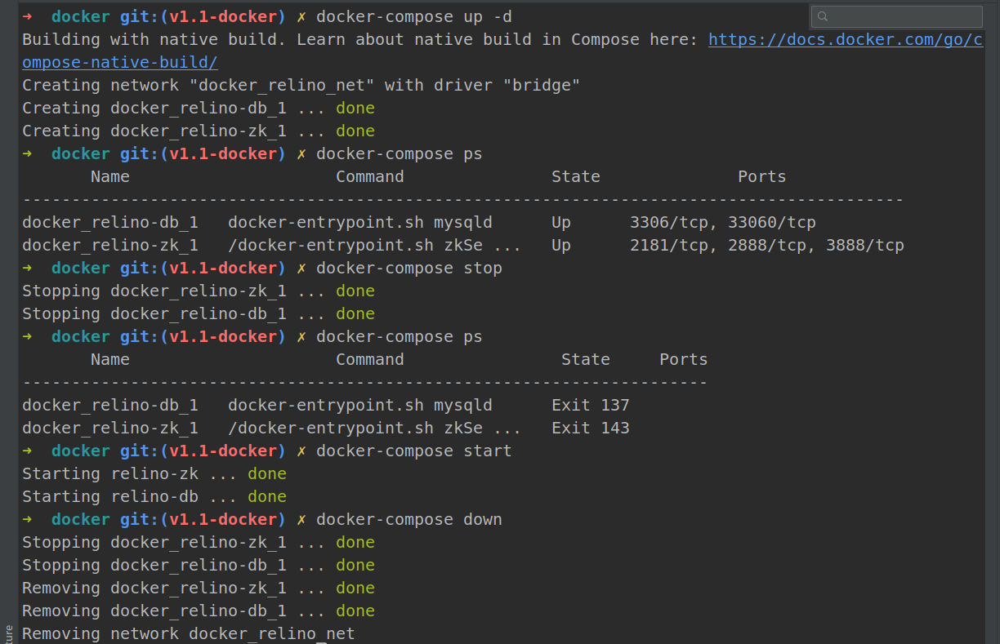

# Docker quick start

使用`docker-compose`搭建了项目所需要的数据库和`Zookeeper`环境。

进入`/project-root/docker/`目录下，运行`docker-compose up -d`命令，将创建如下的环境：

**数据库**

| item     | value             |
| -------- | ----------------- |
| user     | root              |
| password | uU6~_C9Eao@Ph$H!3 |
| ip       | 172.20.0.3        |
| port     | 3306              |
| database | relino_demo       |

**Zookeeper**

| item     | value      |
| -------- | ---------- |
| ip       | 172.20.0.2 |
| port     | 2181       |
| user     | 无         |
| password | 无         |

已经在`relino-demo`模块下`docker profile config.properties`中配置，选择`docker profile`即可运行该模块下的例子。

**自定义配置** 在`/project-root/docker/.env`文件中，支持指定数据库`root`用户密码以及数据库和`Zookeeper`环境的ip，可根据需要修改。

### docker-compose 常用命令

简单介绍下一个完整生命周期可能用到的命令：

```shell script
# 构建并启动容器
docker-compose up -d

# 查看
docker-compose ps

# 停止
docker-compose stop

# 启动
docker-compose start

# 删除当前容器、网络、image等
docker-compose down
```




